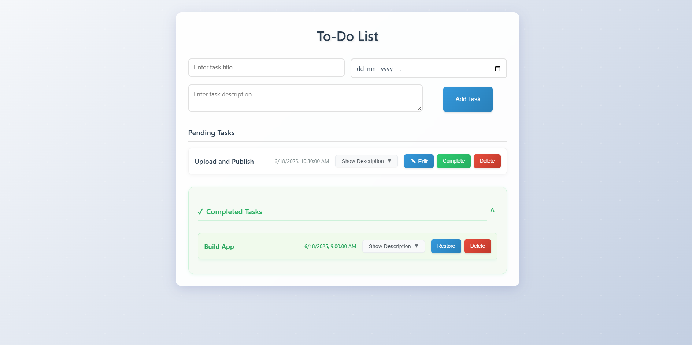

# 📝 Modern To-Do List App

A sleek and responsive To-Do List web application to help you organize your daily tasks, set deadlines, and track your progress—all right in your browser.

> 🌐 **Live Demo:** [View the To-Do List App](https://pvm-harshavardhan.github.io/todo-list/)



[](LICENSE)
[](https://developer.mozilla.org/en-US/docs/Web/HTML)
[](https://developer.mozilla.org/en-US/docs/Web/CSS)
[](https://developer.mozilla.org/en-US/docs/Web/JavaScript)
[](https://developer.mozilla.org/en-US/docs/Web/API/Window/localStorage)
[](https://git-scm.com/)
[](https://github.com/)
[](https://pages.github.com/)


---

## ✨ Features

- ✨ Create tasks with titles, descriptions, and deadlines
- 📱 Fully responsive design that works on all devices
- 🎨 Modern UI with smooth animations and transitions
- 📋 Separate sections for pending and completed tasks
- 🔄 Edit existing tasks
- ✅ Mark tasks as complete
- 🗑️ Delete tasks
- 💾 Local storage persistence
- 🌈 Beautiful gradient background with subtle patterns


## Usage

1. Enter a task title in the input field
2. (Optional) Add a deadline using the datetime picker
3. (Optional) Add a description for your task
4. Click "Add Task" to create the task
5. Use the buttons to:
   - Edit task details
   - Mark task as complete
   - Delete task
   - Restore completed tasks


## 🚀 Tech Stack

- 	**HTML5** – For structuring the web page
- 	**CSS3** – For styling and responsive design
-	**JavaScript (ES6+)** – For interactive functionality
- 	**LocalStorage API** – For saving tasks in the browser
-	**Git** – Version control
-	**GitHub** – Code hosting and collaboration
-	**GitHub Pages** – Static webPage Hosting


## 🛠️ Getting Started

1. **Clone the repository:**
   ```bash
   git clone https://github.com/pvm-harshavardhan/todo-list.git
   ```
2. **Change to the project directory:**
   ```bash
   cd todo-list
   ```

3. **Open the app:**
   - Simply open `index.html` in your web browser.

## 🖼️ Customization & Screenshots

- Add more images or GIFs to highlight features and UI.
- Update colors and styles in `styles.css` to match your preferences.

## 🌐 Deployment

Deploy your To-Do List easily using **GitHub Pages**, **Netlify**, or **Vercel** for free.

## 🤝 Contributing

Contributions are welcome!  
Feel free to open issues or submit pull requests to improve the app.

## 📄 License

This project is licensed under the MIT License - see the [LICENSE](LICENSE) file for details.

---

## Contact

Your Name - [@pvm_harsha](https://x.com/pvm_harsha)  
Project Link: [GitHub To-Do](https://github.com/pvm-harshavardhan/todo-list)

---